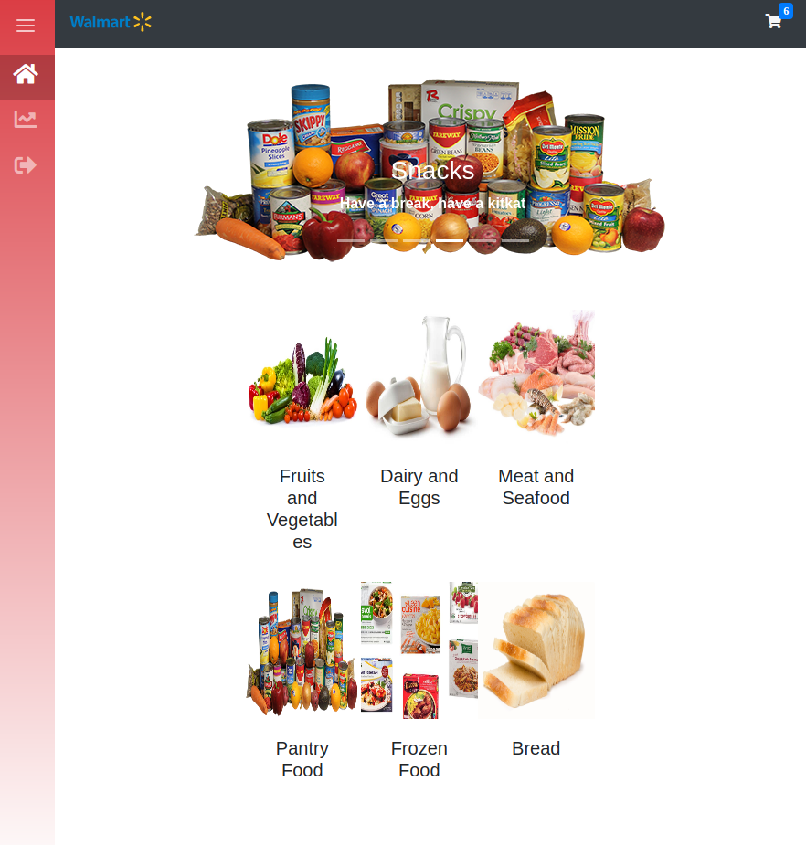
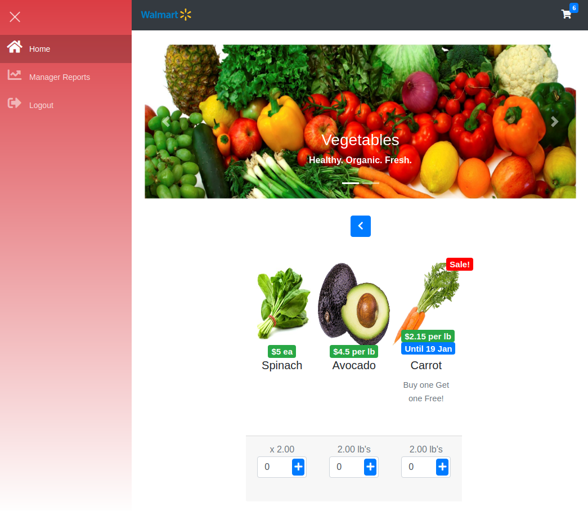

# WineDirect assignment

Time alloted: 48 hours

In this sample you will implement a grocery store cash register. Given a number of items you will be required to calculate the total bill. Items are priced a few of different ways:

A given price for each item, eg. Boxes of Cheerios are $6.99 each

A given price by weight, eg. Apples are $2.49 per pound

Items can be on sale, where you might receive bulk discounts, eg. Buy two get one free sales.

Coupons are also available to get money off the bill when the total amount is above a threshold, eg.$5 off when you spend $100 or more

The goal of this exercise is to evaluate your coding style and OO design skills. 


### Assumptions-

1. Create a Grocery-store cash register - Point of sales system.

2. Mobile view is functional but not focused as not typically used for a POS. Expect general view width to be at least the size of a small tablet.

3. Expect to be using a single measurement to weigh products. All products will be weighed using lb. Expect that cashier manually keys in weight of produce.

4. A cash register infers that for the checkout: we enter the cost, the amount of money taken, and return the amount of change to return to the customer.

### Final Product

Hosted [Here on Netlify](https://zen-joliot-f34c37.netlify.com/)




### Quickstart guide

Run 

```
npm i
```
Start the server with 
```
npm start
```
Navigate and view the site at [localhost:3000](localhost:3000)